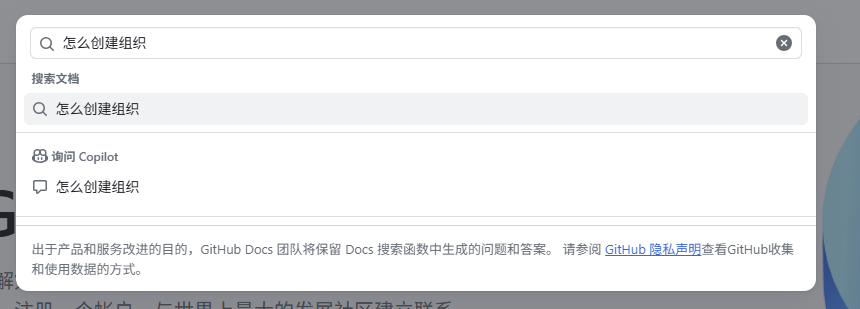
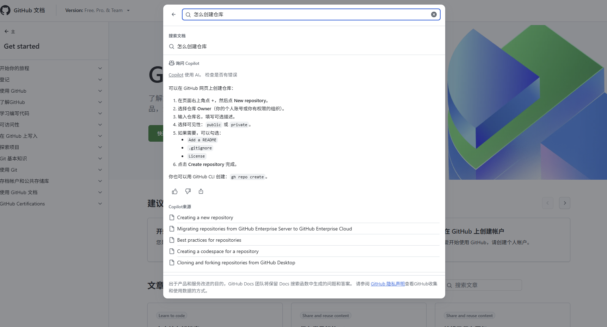
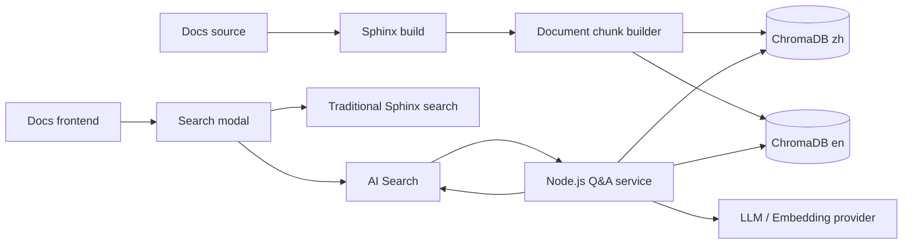

# AI 智能问答设计方案

用户可以在文档站顶部搜索框中输入问题，然后选择使用传统文档搜索，或使用 AI 搜索获取基于文档内容生成的回答。
本功能不是替代现有搜索，而是在现有搜索入口上增加一条 AI 检索增强问答路径：

- **搜索文档**：保留原有传统搜索能力，进入原来的搜索结果页面。
- **AI 搜索**：基于文档向量库和大模型生成回答，并展示引用来源。

## 交互参考

### 开始阶段

用户点击搜索框并输入问题后，弹出搜索面板。面板中提供两个动作：`搜索文档` 和 `AI 搜索`。



### AI 搜索结果阶段

当用户选择 `AI 搜索` 后，面板展示 AI 回答、相关来源和可跳转的文档链接。



## 目标

1. 在现有文档搜索入口上增加 AI 搜索能力，降低用户查找文档内容的成本。
2. 保留传统搜索结果页，用户仍然可以通过 `搜索文档` 使用原有搜索流程。
3. AI 回答必须绑定文档来源，用户可以从回答直接跳转到对应文档页面。
4. 支持中英文双语文档，中文和英文使用独立的向量库，避免跨语言检索结果混杂。
5. 每次文档构建时重新生成向量库，保证问答内容与最新文档一致。

## 交互设计

### 搜索入口

页面顶部搜索框作为统一入口。用户点击搜索框后，不立即跳转页面，而是打开搜索面板。

搜索面板包含：

- 顶部输入框：显示并编辑用户输入的问题。
- `搜索文档` 区域：用于触发传统搜索。
- `AI 搜索` 区域：用于触发 AI 问答。
- 底部说明：提示 AI 搜索结果的生成方式和数据使用说明。

### 搜索文档流程

`搜索文档` 走原来的传统搜索逻辑。

1. 用户点击顶部搜索框。
2. 用户输入关键词或问题。
3. 搜索面板展示 `搜索文档` 选项。
4. 用户点击 `搜索文档` 下方的查询项，或使用默认搜索提交方式。
5. 页面跳转到原有搜索结果页。
6. 搜索结果页继续使用当前 Sphinx 文档搜索能力。

该路径不调用 AI 服务，也不查询向量库。

### AI 搜索流程

`AI 搜索` 用于基于文档内容生成回答。

1. 用户点击顶部搜索框。
2. 用户输入自然语言问题。
3. 搜索面板展示 `AI 搜索` 选项。
4. 用户点击 `AI 搜索` 下方的查询项。
5. 前端将问题、当前语言和当前页面路径发送给 Node.js 问答服务。
6. Node.js 服务根据语言选择对应的 ChromaDB 向量库进行检索。
7. 智能体基于召回的文档切片生成回答。
8. 前端在面板中展示回答、引用来源和可跳转文档链接。

### 交互状态

搜索面板至少需要支持以下状态：

- 空输入：提示用户输入问题或关键词。
- 输入中：同步更新 `搜索文档` 和 `AI 搜索` 的查询文本。
- 传统搜索提交：跳转到原搜索结果页。
- AI 搜索提交：展示加载状态。
- AI 回答成功：展示回答和来源。
- AI 无结果：提示未在当前语言文档中找到相关内容。
- AI 服务异常：提示服务暂不可用，并保留传统搜索入口。

## 系统架构



## 向量库设计

### 技术选型

使用 ChromaDB v3 作为本地向量库，存储文档切片和检索元数据。

### 分语言存储

根据文档语言创建不同的库或 collection：

- 中文文档：`docs_zh`
- 英文文档：`docs_en`

问答请求必须携带语言参数。当前页面位于 `/zh/` 时查询中文库，位于 `/en/` 时查询英文库。

### 构建策略

每次构建文档时，向量库都重新生成：

1. 清除旧的 ChromaDB 数据。
2. 分别读取中文和英文构建产物或源文档。
3. 按标题、段落、列表和代码块进行文档切片。
4. 为每个切片生成 embedding。
5. 写入对应语言的 ChromaDB collection。

这样可以避免旧文档切片残留，确保问答内容与最新发布文档一致。

### 切片元数据

每个文档切片至少保存以下字段：

| 字段 | 说明 |
| --- | --- |
| `id` | 切片唯一标识 |
| `language` | 文档语言，例如 `zh` 或 `en` |
| `title` | 文档标题 |
| `section` | 当前章节标题 |
| `source_path` | 源文档路径 |
| `docs_url` | 可跳转的文档页面地址 |
| `anchor` | 页面内章节锚点 |
| `content` | 切片正文 |

`docs_url` 和 `anchor` 用于在 AI 搜索回答来源中生成跳转链接。

## Node.js 问答服务

使用 Node.js 实现 AI 搜索服务，负责连接前端搜索面板、ChromaDB 和大模型能力。

### 职责

Node.js 服务负责：

- 接收 AI 搜索问题。
- 判断或接收当前语言。
- 查询对应语言的 ChromaDB。
- 组装检索上下文。
- 调用大模型生成回答。
- 返回答案和引用来源。

大模型参数通过 `server/ai-search.config.json` 注入，并随私有仓库与 Docker 镜像一起交付。运行时可通过 `AI_QA_CONFIG` 切换配置文件，或通过环境变量覆盖关键参数。默认关闭深度思考：`thinking.type = disabled`；如后续需要开启，可在配置中改为供应商支持的取值。

传统 `搜索文档` 不经过该服务，仍然沿用原有搜索结果页。

### 建议接口

```http
POST /api/ai-qa/chat
Content-Type: application/json
```

请求示例：

```json
{
    "language": "zh",
    "question": "如何配置反向代理？",
    "currentPath": "/zh/deployment/reverse-proxy.html"
}
```

响应示例：

```json
{
    "answer": "可以在服务器 Nginx 的 docs.proteinseek.com server 块中添加 /workbench/ 相关 location，并通过 proxy_pass 转发到本机文档容器。",
    "sources": [
        {
            "title": "反向代理配置",
            "section": "Nginx 片段",
            "url": "/zh/deployment/reverse-proxy.html#nginx"
        }
    ]
}
```

## 前端集成

### 搜索框行为

现有顶部搜索框改为统一搜索面板入口：

- 点击搜索框时打开搜索面板。
- 搜索面板打开后，自动聚焦输入框。
- 用户输入内容后，同时显示 `搜索文档` 和 `AI 搜索` 两个选项。
- 点击 `搜索文档` 时，跳转到原有传统搜索结果页。
- 点击 `AI 搜索` 时，在面板内展示 AI 回答。
- 弹窗关闭后，焦点回到搜索框。
- 保留键盘体验，例如 `Esc` 关闭面板，`Enter` 触发默认搜索行为。

### AI 回答展示

AI 回答区域应同时展示：

- AI 生成的自然语言回答。
- 召回来源列表。
- 来源文档的可点击链接。
- 生成中、失败、无结果等状态。

如果没有检索到可靠文档来源，系统应明确提示“未在当前文档中找到相关内容”，避免凭空回答。

## 构建与部署

### 构建流程

文档构建流程需要增加向量库生成步骤：

1. 构建中文 HTML 文档。
2. 构建英文 HTML 文档。
3. 清理旧 ChromaDB 数据。
4. 基于中英文文档生成新的向量库。
5. 打包静态文档、Node.js 服务和 ChromaDB 数据。

### 部署形态

推荐将 AI 搜索服务作为文档站的一部分部署：

- 静态文档继续由 Nginx 提供。
- 传统搜索继续使用现有静态搜索结果页。
- Node.js 服务提供 `/api/ai-qa/*` 接口。
- ChromaDB 数据随每次构建产物更新。
- 反向代理将 AI 搜索接口转发到 Node.js 服务。

## 实施阶段

### 阶段一：搜索面板与双入口

- 实现搜索框点击打开搜索面板。
- 在输入阶段展示 `搜索文档` 和 `AI 搜索` 两个选项。
- 保留 `搜索文档` 的传统搜索跳转能力。
- 为 `AI 搜索` 增加提交、加载、错误和回答展示状态。

### 阶段二：文档切片与 ChromaDB 构建

- 实现中英文文档切片脚本。
- 写入 ChromaDB v3。
- 为每个切片绑定文档路径和章节锚点。

### 阶段三：检索增强问答

- 增加 Node.js AI 搜索接口。
- 接入 embedding 和大模型能力。
- 根据当前语言检索对应向量库。
- 返回回答和文档来源。

### 阶段四：体验优化

- 优化召回结果排序。
- 增加来源高亮和跳转体验。
- 增加无结果、低置信度和服务异常提示。
- 根据实际使用情况调整切片大小和召回数量。

## 注意事项

- `搜索文档` 必须继续走原有传统搜索结果页，不能被 AI 搜索替代。
- `AI 搜索` 是新增能力，对应开始阶段截图中的第二个选项位置，页面文案统一命名为“AI 搜索”。
- AI 回答必须基于文档来源生成，不能脱离文档内容自由发挥。
- 中英文向量库必须分开构建和查询。
- 每次构建必须清空旧向量库，避免历史内容污染结果。
- 文档路径和章节锚点是核心元数据，必须随切片一起保存。
- 大模型和 embedding 服务应通过配置接入，避免把供应商参数散落在业务代码中。
